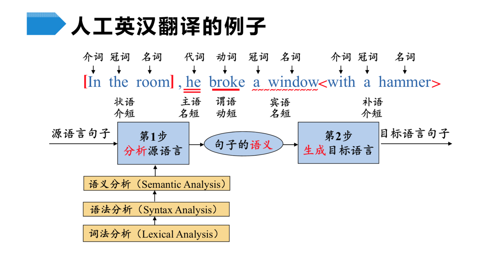
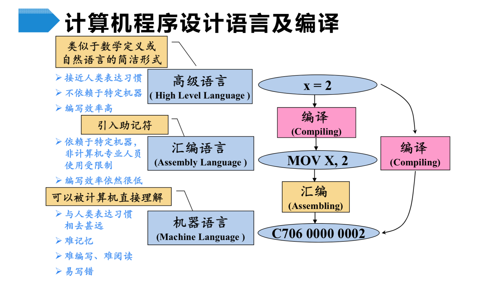

## 如何让计算机理解代码

>从最基本的角度看，一种编程语言就是：把一组特定的**词汇**，按照一组特定的**语法**规则组合到一起，形成计算机可以通过某种方式“**理解**”的东西，可以让计算机据此执行特定的**动作**。

这不是一个很容易解释的话题。相比人类，计算机是一个没有感情的机器。没有感情有好也有坏。好处就是你定义好规则，它就会按照你的规则办事。如何制定这个规则，也就是如何设计一门语言。人类有English，中文，日本人，Espanol，عربي， 한국어...。每个语言都有自己的表达规则，计算机语言也不例外。那么如何从无到有设计一套语言呢？在开始设计之前，我们先来理解几个基础词汇。

- 文法 （Grammar）
- 语法  (Syntax)
- 词法 （Lexical）

以人工英汉翻译为例


首先是解析的过程： 

当拿到一个句子，我们首先理解了每一个词（词组）的意思（词法分析），然后理解词组组合后的短语（语法分析）。最后将短语组合翻译，变成一个句子的语义（语义分析）。这个语义是中间表示，独立于具体的语言。拿到语义之后你就可以生成目标语言。人类翻译的目标语言可以是“中文”，“韩文”，“法文”等等。具体是哪个形式，由接受人决定，你翻译给谁听，就译成ta理解的形式。而对计算机而言，目标语言就是机器语言。



知道了这个过程之后，我们就可以继续思考一下，如何取制定一套语言的文法规则。

## 如何设计一套计算机语言

根据我们上面的分析，要想让计算机“读”懂我们的代码，就要有一套固定的语义，语法和词法体系。那么现在我们常用的语言是按照什么规则制定的呢？

### 语法部分

#### 非形式语法

- 中文 英文

#### 形式语法（乔姆斯基谱系）

- O型  无限制文法
  - `?::=?`
- 1型  上下文相关文法
  - `?<A>?::=?<B>`
- 2型  上下文无关文法
  - `<A>::=?`
- 3型  正则文法
  - `<A>::=<A>？`

其中 **上下文无关语言**为大多数**程序设计语言**的语法提供了理论基础。

在这个理论基础上，有了一些具体的实践。 以BNF为例，BNF是比较常见的一种形式。

### 产生式 巴科斯诺尔范式 (Backus Normal Form —— BNF)

- 用尖括号括起来的名称来表示语法结构名
- 语法结构分成基础结构和需要用其他语法结构定义的复合结构
  - 基础结构称终结符
  - 复合结构称非终结符
- 引号和中间的字符表示终结符
- 可以有括号
- `*` 表示重复多次
- `|` 表示或
- `+` 表示至少一次

一个四则运算的BNF凡是

```bash
<Number> ::= "0" | "1" | "2" | "3" | "4" | ... | "9"

<DecimalNumber> ::= "0" | (("1" | "2" | "3" | "4" | ... | "9")<Number>*)

<PrimaryExpression> ::= <DecimalNumber> | "(" <LogicalExpression> ")"

<Multiplicative> ::= <PrimaryExpression> |
                   <Multiplicative> "*" <PrimaryExpression> |
                   <Multiplicative> "/" <PrimaryExpression>

<AddtiveExpression> ::= <Multiplicative> |
                      <AddtiveExpression> "+" <Multiplicative> |
                      <AddtiveExpression> "-" <Multiplicative>


<logicalExpression> ::= <AddtiveExpression> |
                      <logicalExpression> "||" <AddtiveExpression> |
                      <logicalExpression> "&&" <AddtiveExpression>
```

### 常见的语言分析

#### JavaScript

JavaScript语法多是上下文无关文法为主。但是也有特殊的情况，比如:

```javascript
    {
        get a {return 1},  //在这里get是一个关键字
        get: 1             //而在这里就是一个变量名
    }
```

表达式部分多在3型，正则文法。但也有特殊的情况，

```js
    2**1**2
```

Javascript中，`/`可能是除号，也可能是正则表达式开头，处理方式类似VB，字符串模板中也需要特殊处理，还有自动插入分号规则。

#### C++

C++是非形式化语言，C++中，`*`坑你表示乘号或者指针，具体是哪个，取决于星号前面的标识符是否被声明为类型

#### VB

VB基本上是1型。`<`可能是小于号，也可能是XML直接量的开始，取决于当前位置是否可以接受XML直接量。

### Python

行首的Tab符和空格会根据上一行的行首空白以一定规则被处处理成虚拟终结符indent或者dedent

### 其他语言

Lisp, C, PHP, JAVA, SQL

## reference

[怎样设计一套程序设计语言？](https://www.zhihu.com/question/19756886)
[编译原理（哈工大）—— bilibili](https://www.bilibili.com/video/BV1zW411t7YE?from=search&seid=1590568849937040326)